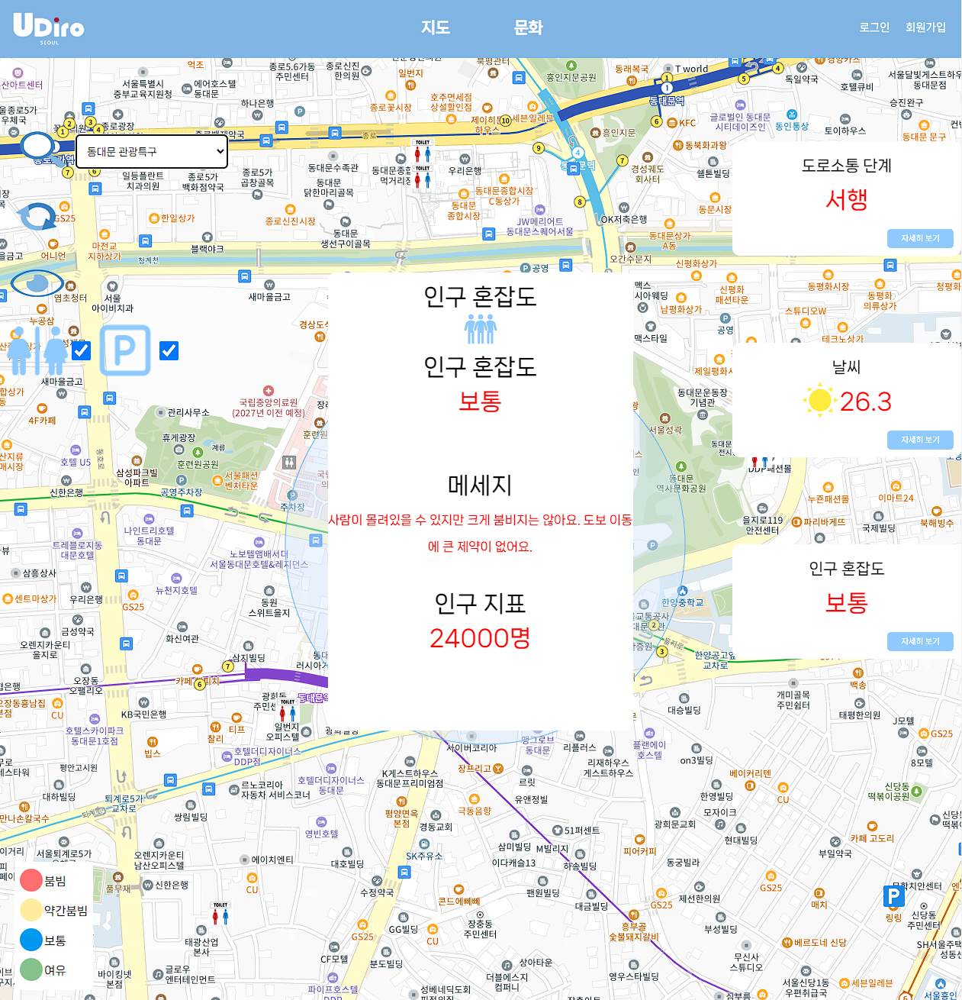

# UDiro 개요
html, javascript, node.js 기반의 서울시 실시간 인원현황에 따른 혼잡량을 볼수 있는 웹 페이지
[우디로 바로가기](https://port-0-udiro-client-dcse2bli92yw8t.sel4.cloudtype.app/)

작년 할로윈에 발생한 이태원 참사를 보고 사람이 이렇게까지 많은 지 개개인이 알 수 있었다면, 인원에 통제에도 애를 먹지 않아도 되었지 않았을까 하는 의문이 들었습니다. 

첫번째 이유에 대해 실시간 인구 분포도를 가지고 있지 못한 인원통제 인력들도 저희 사이트를 확인하여 적절한 인원 분배를 통한 효율적인 인구 관리를 할 수 있다는 기대가 두번째 이유였습니다.

우디로 프로젝트를 통해 사람들이 다닐때 조금 더 안전하고 쾌적하게 여가생활을 즐길수 있도록 하는것이  
우디로 프로젝트의 목적 입니다.

## 🎆 Front-End

    &nbsp;&nbsp;
    &nbsp;&nbsp;
  &nbsp;&nbsp;

## 🎇 Back-End

       &nbsp;&nbsp;

 

# 주요 활용 API
[서울 열린데이터 광장 실시간 도시 데이터](http://data.seoul.go.kr/dataList/OA-21285/F/1/datasetView.do)

# 우디로 미리 보기
## 메인화면 

## 지도 화면

## 문화 화면

## 로그인 화면

